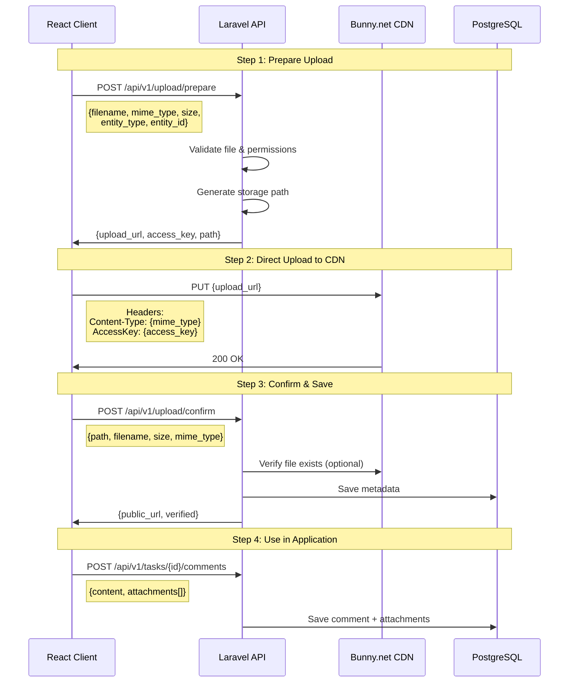

# File Upload System with Bunny.net CDN

## Overview

A reusable, secure file upload system that works with **any entity type** across the application. Files are uploaded directly from the browser to Bunny.net CDN, minimizing server load and maximizing upload speed.

**Status:** ✅ Implemented and Working  
**Date:** December 2024  
**CDN Provider:** Bunny.net Storage API

---

## Architecture

### High-Level Flow



### Key Design Principles

1. **Direct Browser-to-CDN Upload** - Files never pass through Laravel server
2. **Short-lived Access Keys** - 60-second TTL for security
3. **Entity-agnostic** - Works with any entity type (tasks, users, projects, etc.)
4. **Company-scoped Paths** - Multi-tenant isolation at storage level
5. **Type & Size Validation** - Whitelist approach for security

---

## Implementation Details

### Backend Components

#### 1. Configuration (`backend/config/services.php`)

```php
'bunny' => [
    'storage_zone' => env('BUNNY_STORAGE_ZONE'),
    'storage_password' => env('BUNNY_STORAGE_PASSWORD'),
    'storage_url' => env('BUNNY_STORAGE_URL'),
    'region' => env('BUNNY_REGION'),
    'base_url' => env('BUNNY_BASE_URL'),
    'max_file_size' => 26214400, // 25 MB in bytes
],
```

**Environment Variables Required:**
- `BUNNY_STORAGE_ZONE` - Your Bunny.net storage zone name
- `BUNNY_STORAGE_PASSWORD` - Storage zone password (AccessKey)
- `BUNNY_STORAGE_URL` - Storage API URL (e.g., `https://storage.bunnycdn.com`)
- `BUNNY_REGION` - Region code (e.g., `ny`, `de`, `sg`)
- `BUNNY_BASE_URL` - Public CDN URL for file access

#### 2. BunnyStorageService (`backend/app/Services/BunnyStorageService.php`)

**Core Service Methods:**

```php
// Generate upload URL with access key
public function generateUploadUrl(string $path, array $options = []): array

// Verify file exists on CDN
public function verifyFileExists(string $path): bool

// Get public CDN URL
public function getPublicUrl(string $path): string

// Delete file from storage
public function deleteFile(string $path): bool

// Generate organized storage path
public function generateStoragePath(
    string $companyId,
    string $entityType,
    ?string $entityId,
    string $filename
): string

// Validate file size & MIME type
public function validateFileSize(int $size): bool
public function validateMimeType(string $mimeType): bool
```

**Storage Path Structure:**

```
{company_id}/{entity_type}/{entity_id}/{timestamp}_{random}_{filename}

Examples:
- Task comments: 019b239a-51c7/tasks/019b391a-b94d/comments/1766350450_B9bvbDe5_report.pdf
- User avatars:  019b239a-51c7/users/c441dc7d-b518/avatar/1766350789_xK3mP2aQ_profile.jpg
- Project files: 019b239a-51c7/projects/019b391a-9881/files/1766350950_qW8nR4tY_design.png
```

**Unique Filename Generation:**
```php
{timestamp}_{8-char-random}_{sanitized-original-name}
// Prevents: collisions, overwrites, path traversal
```

#### 3. UploadController (`backend/app/Http/Controllers/Api/UploadController.php`)

**Endpoint 1: Prepare Upload**

```
POST /api/v1/upload/prepare

Request:
{
  "filename": "document.pdf",
  "mime_type": "application/pdf",
  "size": 1048576,
  "entity_type": "task_comment",
  "entity_id": "uuid-or-null"
}

Response (200):
{
  "success": true,
  "upload_url": "https://storage.bunnycdn.com/zone/path/file.pdf",
  "access_key": "xxx-storage-password-xxx",
  "path": "company/tasks/task-id/comments/file.pdf",
  "expires_at": "2024-12-21T12:01:00Z"
}

Errors:
- 422: Validation failed (invalid size/type)
- 403: Permission denied
- 400: Company context required
```

**Endpoint 2: Confirm Upload**

```
POST /api/v1/upload/confirm

Request:
{
  "path": "company/tasks/task-id/comments/file.pdf",
  "filename": "document.pdf",
  "mime_type": "application/pdf",
  "size": 1048576
}

Response (200):
{
  "success": true,
  "verified": true,
  "path": "company/tasks/task-id/comments/file.pdf",
  "public_url": "https://cdn.example.com/company/tasks/task-id/comments/file.pdf",
  "filename": "document.pdf",
  "mime_type": "application/pdf",
  "size": 1048576
}

Note: Verification is non-blocking. If verification fails, it logs a warning
but still returns success since the upload to Bunny was successful.
```

**Permission Validation:**
- User must be authenticated
- Company context required (X-Company-ID header)
- Entity-specific checks (e.g., can only upload own avatar)

#### 4. Task Comment Integration (`backend/app/Http/Controllers/Api/TaskCommentController.php`)

```php
POST /api/v1/tasks/{taskId}/comments

Request:
{
  "content": "Comment text",
  "attachments": [
    {
      "filename": "report.pdf",
      "path": "company/tasks/task-id/comments/file.pdf",
      "mime_type": "application/pdf",
      "size": 1048576
    }
  ]
}

// Creates TaskComment + TaskAttachment records
// Broadcasts TaskCommentAdded event
```

#### 5. API Routes (`backend/routes/api.php`)

```php
Route::prefix('v1')->middleware('supabase.auth')->group(function () {
    // Generic upload endpoints (reusable for any entity)
    Route::post('/upload/prepare', [UploadController::class, 'prepare']);
    Route::post('/upload/confirm', [UploadController::class, 'confirm']);
    
    // ... other routes
});
```

**Middleware Chain:**
1. `supabase.auth` - Validates JWT token
2. Request includes `X-Company-ID` header (set by api.ts interceptor)

---

### Frontend Components

#### 1. useFileUpload Hook (`apps/client/src/hooks/useFileUpload.ts`)

**Reusable React Hook for File Uploads**

```typescript
import { useFileUpload } from '../hooks/useFileUpload'

const { uploadFile, uploadMultiple, uploading, progress } = useFileUpload({
  entityType: 'task_comment',
  entityId: taskId,
  onProgress: (file, percent) => console.log(`${file.name}: ${percent}%`),
  onSuccess: (file, result) => console.log('Uploaded!', result),
  onError: (file, error) => console.error('Failed', error),
})

// Upload single file
const result = await uploadFile(file)

// Upload multiple files
const results = await uploadMultiple([file1, file2, file3])
```

**Features:**
- 3-step upload flow (prepare → upload → confirm)
- Progress tracking per file
- Error handling with retry capability
- Multiple file support
- Type-safe with TypeScript

**Upload Flow in Hook:**

```typescript
1. Prepare: POST /api/v1/upload/prepare
   → Get: upload_url, access_key, path

2. Upload: PUT {upload_url} with AccessKey header
   → Track progress with onUploadProgress
   → Get: 200 OK from Bunny

3. Confirm: POST /api/v1/upload/confirm
   → Get: public_url, verified status
   
4. Return: UploadedFile object
```

#### 2. FileUploadButton Component (`apps/client/src/components/FileUploadButton.tsx`)

**Features:**
- Click to open drag & drop zone
- Drag & drop support
- Multiple file selection
- Real-time progress bars
- Image thumbnails
- File type icons (PDF, Word, Excel, Archive)
- Upload status indicators (pending, uploading, completed, error)
- File size validation
- Cancel/retry functionality

**Usage:**

```tsx
<FileUploadButton
  entityType="task_comment"
  entityId={taskId}
  multiple={true}
  accept="image/*,.pdf,.doc,.docx"
  maxSize={26214400} // 25 MB
  onUploadComplete={(files) => {
    console.log('All files uploaded:', files)
    setAttachments(files)
  }}
  disabled={isSubmitting}
/>
```

**UI States:**
- **Collapsed:** Shows paperclip icon button
- **Expanded:** Shows drag & drop zone with instructions
- **Uploading:** Shows progress for each file
- **Completed:** Shows checkmark, allows removal
- **Error:** Shows error message, allows retry

#### 3. AttachmentList Component (`apps/client/src/components/AttachmentList.tsx`)

**Features:**
- Grid layout for attachments
- Image thumbnails (150x150)
- Document type icons (FileText, FileSpreadsheet, Archive)
- Formatted file sizes ("1.2 MB")
- Download functionality
- Delete functionality (optional)
- Compact mode for inline display

**Usage:**

```tsx
<AttachmentList
  attachments={comment.attachments}
  canDelete={isOwner}
  onDelete={(id) => handleDeleteAttachment(id)}
  compact={false} // true for horizontal compact layout
/>
```

#### 4. TaskDetailDrawer Integration (`apps/client/src/components/TaskDetailDrawer.tsx`)

**Implementation:**

```tsx
// State for pending attachments
const [pendingAttachments, setPendingAttachments] = useState<UploadedFile[]>([])

// File upload button in comment input
<FileUploadButton
  entityType="task_comment"
  entityId={task.id}
  onUploadComplete={(files) => {
    setPendingAttachments(prev => [...prev, ...files])
  }}
/>

// Preview pending attachments
{pendingAttachments.length > 0 && (
  <AttachmentList
    attachments={pendingAttachments}
    canDelete={true}
    onDelete={(id) => setPendingAttachments(prev => 
      prev.filter(f => f.path !== id)
    )}
    compact={true}
  />
)}

// Submit comment with attachments
const handlePostComment = async () => {
  await api.post(`/api/v1/tasks/${task.id}/comments`, {
    content: commentContent,
    attachments: pendingAttachments.map(file => ({
      filename: file.filename,
      path: file.path,
      mime_type: file.mime_type,
      size: file.size,
    })),
  })
  setPendingAttachments([]) // Clear after submit
}
```

---

## File Validation

### Allowed File Types

```typescript
const ALLOWED_TYPES = {
  images: [
    'image/jpeg',
    'image/png',
    'image/gif',
    'image/webp',
  ],
  documents: [
    'application/pdf',
    'application/msword',
    'application/vnd.openxmlformats-officedocument.wordprocessingml.document',
    'application/vnd.ms-excel',
    'application/vnd.openxmlformats-officedocument.spreadsheetml.sheet',
    'application/vnd.ms-powerpoint',
    'application/vnd.openxmlformats-officedocument.presentationml.presentation',
    'text/plain',
    'text/csv',
  ],
  archives: [
    'application/zip',
    'application/x-rar-compressed',
    'application/x-7z-compressed',
  ],
}
```

### Size Limits

- **Maximum:** 25 MB (26,214,400 bytes)
- **Validated at:** Frontend (immediate feedback) + Backend (security)

### Validation Points

1. **Frontend (FileUploadButton):** Immediate UI feedback before upload
2. **Backend (UploadController):** Security validation before generating URL
3. **Bunny.net:** Storage-level enforcement

---

## Security Measures

### ✅ Authentication & Authorization
- All endpoints require Supabase JWT authentication
- User must be authenticated to upload
- Company context required (multi-tenant isolation)
- Entity-specific permission checks

### ✅ Short-lived Access Keys
- Upload URLs expire after 60 seconds
- Access key included in response, not in URL
- Prevents unauthorized uploads after expiration

### ✅ File Type Whitelist
- Only allowed MIME types accepted
- Validated on backend before upload
- Prevents malicious file uploads

### ✅ File Size Limits
- 25 MB maximum per file
- Enforced on both frontend and backend
- Prevents resource exhaustion

### ✅ Company-scoped Paths
- All files stored under company ID
- Prevents cross-tenant access
- Organized by entity type

### ✅ Unique Filenames
- Timestamp + random string prefix
- Prevents collisions and overwrites
- Sanitized original filename

### ✅ No Path Traversal
- All path components sanitized
- `ltrim`, `rtrim`, `trim` used to prevent `../`
- Company ID, entity type, entity ID validated

---

## Database Schema

### TaskAttachment Table

```sql
CREATE TABLE task_attachments (
    id UUID PRIMARY KEY,
    task_id UUID REFERENCES tasks(id) ON DELETE CASCADE,
    comment_id UUID NULLABLE REFERENCES task_comments(id) ON DELETE CASCADE,
    company_id UUID REFERENCES companies(id) ON DELETE CASCADE,
    uploaded_by UUID REFERENCES users(id) ON DELETE CASCADE,
    
    filename VARCHAR(255) NOT NULL,
    bunny_filename VARCHAR(255) NULLABLE,
    path VARCHAR(500) NOT NULL,
    mime_type VARCHAR(100),
    size BIGINT,
    
    status VARCHAR(20) DEFAULT 'pending', -- pending, processing, completed, failed
    error_message TEXT NULLABLE,
    
    created_at TIMESTAMPTZ,
    updated_at TIMESTAMPTZ
);
```

**Indexes:**
- `task_id` - Fast lookups by task
- `comment_id` - Fast lookups by comment
- `company_id` - Company scoping

**Relationships:**
- `task_attachments.task_id` → `tasks.id`
- `task_attachments.comment_id` → `task_comments.id`
- `task_attachments.company_id` → `companies.id`
- `task_attachments.uploaded_by` → `users.id`

---

## Reusability

### Current Implementation: Task Comments ✅

```typescript
<FileUploadButton
  entityType="task_comment"
  entityId={taskId}
  onUploadComplete={(files) => setAttachments(files)}
/>
```

### Future Use Cases (Ready to Use)

#### 1. User Avatars
```typescript
const { uploadFile } = useFileUpload({ 
  entityType: 'user_avatar', 
  entityId: userId 
})
```

#### 2. Company Logos
```typescript
const { uploadFile } = useFileUpload({ 
  entityType: 'company_logo', 
  entityId: companyId 
})
```

#### 3. Project Files
```typescript
<FileUploadButton
  entityType="project"
  entityId={projectId}
  multiple={true}
  onUploadComplete={(files) => addProjectFiles(files)}
/>
```

#### 4. Contact Documents
```typescript
<FileUploadButton
  entityType="contact"
  entityId={contactId}
  onUploadComplete={(files) => attachToContact(files)}
/>
```

#### 5. Deal Attachments
```typescript
const { uploadMultiple } = useFileUpload({ 
  entityType: 'deal', 
  entityId: dealId 
})
```

#### 6. Message Attachments
```typescript
<FileUploadButton
  entityType="message"
  entityId={conversationId}
  onUploadComplete={(files) => sendMessage(text, files)}
/>
```

---

## Troubleshooting

### Common Issues & Solutions

#### 1. CORS Errors

**Symptom:** `Access-Control-Allow-Origin` error in browser console

**Solution:**
```php
// backend/config/cors.php
'paths' => ['api/*', 'v1/*', 'sanctum/csrf-cookie', 'broadcasting/auth'],
'allowed_origins' => [
    'http://localhost:3000',
    'http://localhost:3001',
    'http://localhost:3002',
],
```

#### 2. 401 Unauthorized from Laravel

**Symptom:** Laravel returns 401 before reaching Bunny

**Causes:**
- Missing/invalid JWT token
- Token expired
- Missing `X-Company-ID` header

**Check:**
```typescript
// Ensure auth token is set
import { setAuthToken } from './lib/api'
setAuthToken(session.access_token)

// Check headers in network tab
Authorization: Bearer xxx
X-Company-ID: xxx
```

#### 3. 401 Unauthorized from Bunny.net

**Symptom:** Bunny returns `{"HttpCode": 401, "Message": "Unauthorized"}`

**Causes:**
- Missing `AccessKey` header in upload request
- Wrong storage password in .env
- Wrong storage zone name

**Solution:**
```typescript
// Ensure AccessKey header is included
await axios.put(upload_url, file, {
  headers: {
    'Content-Type': file.type,
    'AccessKey': access_key, // ← Must include this!
  },
})
```

**Verify .env:**
```bash
BUNNY_STORAGE_PASSWORD=your-storage-password-here
BUNNY_STORAGE_ZONE=your-zone-name
```

#### 4. 400 Bad Request on Confirm

**Symptom:** Upload succeeds but confirm fails

**Causes:**
- File verification timing issue (file not immediately available)
- Wrong storage URL

**Solution:** Already handled - verification is non-blocking

#### 5. Double Slashes in URL

**Symptom:** URL has `//` like `https://storage.bunnycdn.com/zone//company/`

**Solution:** Already fixed with `rtrim`, `trim`, `ltrim`:
```php
$baseUrl = rtrim($this->storageUrl, '/');
$storageZone = trim($this->storageZone, '/');
$filePath = ltrim($path, '/');
$url = "{$baseUrl}/{$storageZone}/{$filePath}";
```

#### 6. Files Not Appearing

**Symptom:** Upload completes but files don't show in UI

**Check:**
1. Database: Are `task_attachments` records created?
2. API response: Does comment include `attachments` array?
3. Component: Is `AttachmentList` rendered?
4. Network: Check `/tasks/{id}/comments` response

---

## Performance Considerations

### Browser-to-CDN Direct Upload
- **Benefit:** No server bandwidth used for uploads
- **Latency:** Single round-trip to CDN (not through Laravel)
- **Scalability:** Laravel doesn't handle file data, only metadata

### Bunny.net CDN Advantages
- **Global Edge Network:** Files served from nearest location
- **Cost-effective:** Competitive pricing vs AWS S3/CloudFront
- **Built-in CDN:** No separate CDN setup required

### Database Impact
- **Minimal:** Only metadata stored (filename, path, size, MIME type)
- **Efficient Queries:** Proper indexes on foreign keys
- **Eager Loading:** `$comment->load('attachments')` to avoid N+1

---

## Future Improvements

### Short-term (Next Sprint)

1. **Image Thumbnails**
   - Generate thumbnails on upload
   - Store thumbnail URLs in database
   - Display optimized images in UI

2. **Progress Persistence**
   - Save upload state to localStorage
   - Resume interrupted uploads
   - Show progress across page refreshes

3. **Batch Operations**
   - Bulk download as ZIP
   - Bulk delete for admins
   - Move files between entities

### Medium-term (Next Quarter)

4. **File Processing**
   - Image optimization (resize, compress)
   - PDF preview generation
   - Virus scanning integration

5. **Advanced Search**
   - Search by filename
   - Filter by file type
   - Search by date range
   - Full-text search in PDFs

6. **File Versioning**
   - Keep previous versions
   - Show version history
   - Restore previous versions

### Long-term (Future)

7. **Real-time Collaboration**
   - Live preview of files
   - Collaborative editing
   - Comment on specific parts of files

8. **AI Integration**
   - Auto-tagging with AI
   - Extract text from images/PDFs
   - Summarize documents
   - Smart file organization

9. **Advanced CDN Features**
   - Image transformations on-the-fly
   - Adaptive quality based on connection
   - Video streaming for uploaded videos

---

## Testing Checklist

### Manual Testing

- [ ] Upload single file to task comment
- [ ] Upload multiple files at once
- [ ] Upload different file types (image, PDF, ZIP)
- [ ] Upload file at size limit (25 MB)
- [ ] Try uploading oversized file (should fail gracefully)
- [ ] Try uploading disallowed file type (should reject)
- [ ] Cancel upload mid-progress
- [ ] Upload same filename twice (should not conflict)
- [ ] View uploaded files in comment
- [ ] Download uploaded file
- [ ] Delete uploaded file
- [ ] Upload file with special characters in filename
- [ ] Upload file as different user (permission check)
- [ ] Upload file without authentication (should fail)

### Browser Compatibility

- [ ] Chrome/Edge (Chromium)
- [ ] Firefox
- [ ] Safari
- [ ] Mobile Safari (iOS)
- [ ] Mobile Chrome (Android)

### Performance Testing

- [ ] Upload 10 files simultaneously
- [ ] Upload file on slow connection (throttled)
- [ ] Upload file on unstable connection
- [ ] Monitor memory usage during large uploads
- [ ] Check CDN cache hit rate

---

## Monitoring & Logging

### Laravel Logs

```php
// Upload preparation
\Log::info('Upload prepared', [
    'user_id' => $user->id,
    'company_id' => $companyId,
    'entity_type' => $entityType,
    'filename' => $filename,
    'size' => $size,
]);

// Upload confirmation
\Log::info('Upload confirmed', [
    'path' => $path,
    'verified' => $verified,
]);

// Upload failure
\Log::error('Upload failed', [
    'user_id' => $user->id,
    'error' => $e->getMessage(),
]);
```

### Metrics to Track

1. **Upload Success Rate:** (successful / total attempts)
2. **Average Upload Time:** By file size
3. **Storage Usage:** Per company, total
4. **Failed Uploads:** Count and reasons
5. **Popular File Types:** Usage distribution

### Alerts to Set Up

- Upload success rate drops below 95%
- Storage approaching quota limit
- Unusual spike in uploads (potential abuse)
- High error rate from specific user/company

---

## Cost Analysis

### Bunny.net Pricing (Example)

- **Storage:** $0.01/GB/month
- **Bandwidth:** $0.01/GB (US, Europe)
- **API Calls:** Free

### Estimated Costs

**Example Company with 50 Users:**
- Average: 10 files/user/month = 500 files/month
- Average file size: 2 MB
- Total storage: 1 GB/month
- Total bandwidth: 5 GB/month (assumes 5x downloads)

**Monthly Cost:** ~$0.06 (storage + bandwidth)

**Compared to AWS S3:**
- S3 Storage: $0.023/GB
- S3 Bandwidth: $0.09/GB
- Monthly Cost: ~$0.47 (7.8x more expensive)

---

## References

- [Bunny.net Storage API Documentation](https://docs.bunny.net/docs/storage-api)
- [Laravel HTTP Client](https://laravel.com/docs/11.x/http-client)
- [Axios Documentation](https://axios-http.com/docs/intro)
- [React File Upload Best Practices](https://web.dev/file-upload/)

---

## Changelog

### v1.0.0 - December 2024
- ✅ Initial implementation
- ✅ Direct browser-to-CDN uploads
- ✅ Task comment attachments
- ✅ Image thumbnails and file type icons
- ✅ Drag & drop support
- ✅ Progress tracking
- ✅ Reusable hook and components
- ✅ Security measures implemented
- ✅ Company-scoped storage
- ✅ File type and size validation

### Known Issues
- File verification can be slow (non-blocking now)
- No thumbnail generation yet
- No image optimization on upload

### Next Version (v1.1.0 - Planned)
- [ ] Automatic thumbnail generation
- [ ] Image optimization pipeline
- [ ] Batch operations
- [ ] Enhanced error recovery
- [ ] Upload resume after interruption


